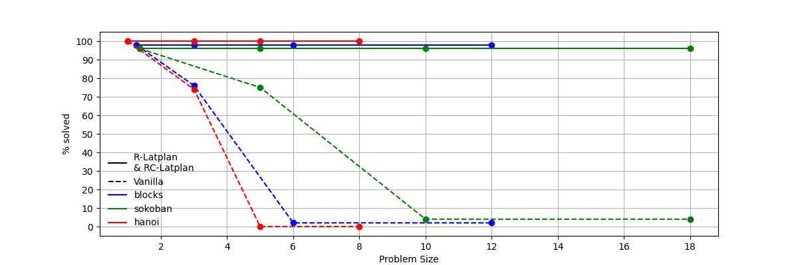
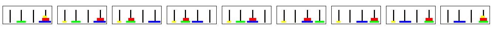
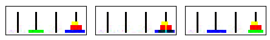

# R-Latplan: Learning Reliable PDDL Models for Classical Planning from Visual Data

> A Neuro-Symbolic Learning Framework for Visually Grounded and Executable Planning Models


## 📜 Abstract

**R-Latplan** is a novel framework that learns **reliable PDDL (Planning Domain Definition Language)** action models directly from **noisy image observations** without any expert supervision or manually annotated symbolic states. It extends the original **Latplan** system by introducing a transition identifier function that anchors learned transitions to **real-world agent actions**, ensuring **executability, interpretability, and robustness**.

This repository contains the official implementation and experimental benchmarks presented in our ICTAI 2024 paper:  
**"Learning Reliable PDDL Models for Classical Planning from Visual Data"**  
by Aymeric Barbin, Federico Cerutti, Alfonso Gerevini

[[Read the Paper (PDF)]](./Learning_Reliable_PDDL_Models_for_Classical_Planning_from_Visual_Data.pdf)

---

## 🚀 Highlights

- 🔗 **Reliable Symbolic Learning**: Learns executable action models directly linked to high-level agent capabilities.
- 🧠 **Neuro-Symbolic Backbone**: Integrates Variational AutoEncoders with symbolic reasoning.
- 🖼️ **Visual Data Only**: Trained from image traces without human-labelled annotations.
- 🧪 **Robustness to Noise**: Handles mislabeled transitions and noisy observations.
- 🧩 **Domain-Independent**: Validated on classic planning benchmarks (Hanoi, Blocksworld, Sokoban).

---

## 📂 Project Structure
```bash
R-latplan/
├── downward/                     # Fastdownward
├── latplan/                      # Core neural networks (SAE, APPLY, REGRESS)
├── r_latplan_datasets/           # Scripts for generating R Latplan dataset (from PDDLGym)
├── r_latplan_exps/               # Training (weights ...) and Testing results per type of experiment (R-Latplan)
├── r_vanilla_latplan_datasets/   # Scripts for generating Vanilla Latplan dataset (from PDDLGym)
├── r_vanilla_latplan_exps/       # Training (weights ...) and Testing results per type of experiment (Vanilla Latplan)
├── README.md              # This file
└── paper.pdf              # The published paper
````

## 🧪 Experiments & Results

We designed five experiments across three benchmark domains—**Hanoi**, **Blocksworld**, and **Sokoban**—to evaluate R-Latplan's reliability and robustness:

| Research Question | Objective |
|-------------------|-----------|
| **RQ1** | Does R-Latplan produce visually and semantically reliable PDDL actions even under noise? |
| **RQ2** | Can classical planners (e.g., Fast Downward) find optimal plans using learned models from noisy/incomplete traces? |
| **RQ3** | Is R-Latplan robust to errors in the transition identifier function? |

**Highlights from the results:**

- ✅ R-Latplan always links PDDL actions to real agent capabilities.
- ✅ It avoids hallucinations common in Latplan.
- ✅ Fast Downward solved all benchmark tasks with optimal plans.
- ✅ Robust against image noise and transition mislabeling.


---

## 📊 R-Latplan vs Vanilla Latplan: Executability & Robustness

We evaluated **execution success** over the longest valid paths derived from visual DFAs in:

- **Exp1**: Crisp and Complete Visual DFAs  
- **Exp2**: Noisy and Complete Visual DFAs  

The figure below reports the **% of successful executions** (maximum success = 3 test runs per configuration) across increasing problem sizes and benchmark domains:



- **Solid lines**: R-Latplan  
- **Dashed lines**: Vanilla Latplan

✅ R-Latplan maintains near-perfect execution, even with noise.  
❌ Vanilla Latplan struggles on long plans and under noisy conditions.

---

## 🖼️ Visual Plan Comparison: R-Latplan vs Vanilla Latplan

Below is an example comparing plans generated by both systems in the **Hanoi domain**:

### ✅ R-Latplan (Visually Correct Plan)

Each image represents a valid agent-executable transition.



---

### ❌ Vanilla Latplan (Visually Incorrect Plan)

Hallucinated transitions or visual artifacts lead to execution failure.



---


## ▶️ Running the Experiments

### Step 1: Generate Visual Traces
```bash
python data/generate_traces.py --domain blocksworld
````
### Step 2: Train R-Latplan
```bash
python train.py --domain blocksworld --config configs/blocksworld.json
````
### Step 3: Generate PDDL Domain
```bash
python planner/generate_pddl.py --model outputs/blocksworld_model.pt
````
### Step 4: Solve with Fast Downward
```bash
python planner/run_planner.py --domain outputs/blocksworld.pddl --problem problems/blocksworld/p01.pddl
````


---

## 📜 Citation

If you use this code or build upon this work, please cite the following paper:

```bibtex
@inproceedings{barbin2024rlatplan,
  title={Learning Reliable PDDL Models for Classical Planning from Visual Data},
  author={Barbin, Aymeric and Cerutti, Federico and Gerevini, Alfonso Emilio},
  booktitle={36th IEEE International Conference on Tools with Artificial Intelligence (ICTAI)},
  year={2024}
}
```
---

## 👤 Authors

- **Aymeric Barbin**  
  Doctorate in Artificial Intelligence – Sapienza University of Rome  
  [aymeric.barbin@uniroma1.it](mailto:aymeric.barbin@uniroma1.it)  
  [GitHub @aymeric75](https://github.com/aymeric75)

- **Federico Cerutti**  
  University of Brescia, Italy

- **Alfonso E. Gerevini**  
  University of Brescia, Italy

